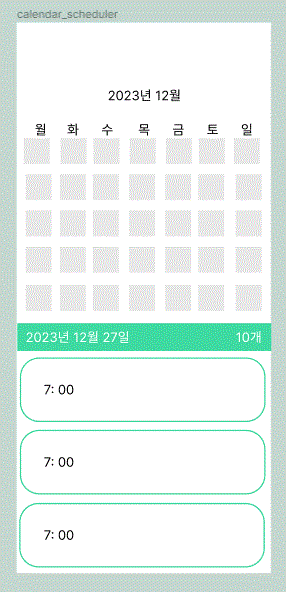
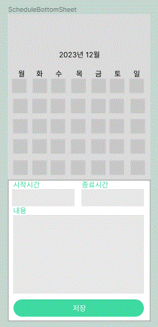
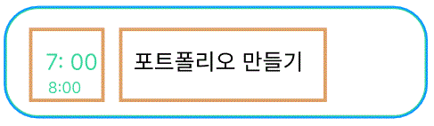
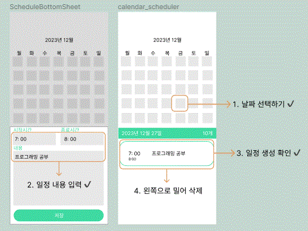
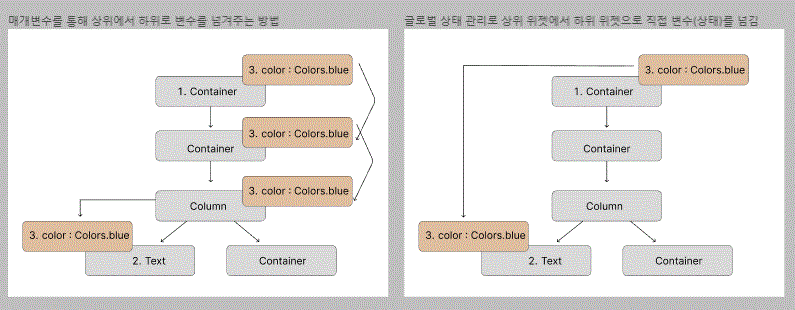
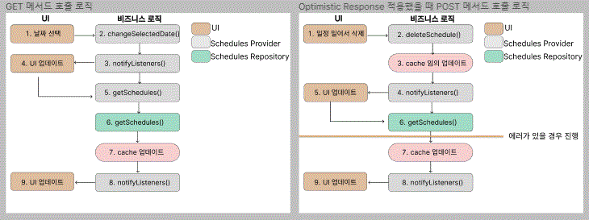
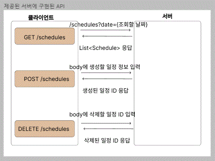

# calendar_scheduler

### 기능 :

- 일정 추가 버튼을 눌러서 새로운 일정 폼을 열기
- 새로운 일정 폼에 일정 정보를 입력해서 새로운 일정을 생성하기
- 달력의 날짜를 눌러서 특정 날짜의 일정 조회하기
- 선택한 날짜에 몇 개 일정이 있는지 확인하기
- 일정을  SQLite 데이터베이스에 저장하거나 서버에 저장하기

### 핵심 구성요소

- REST API
- Dio
- SQLite
- Drift
- Code Generation
- Table Calendar
- TextFormField

### 플러그인

dependencies

- table_calendar
- intl: 0.17.0
- drift: 2.1.0
- splite3_flutter_libs:0.510
- path_provider:2.0.11
- path: 1.8.3 -> 변경 
- get_it : 7.2.0
- dio : 4.0.6
- provider : 6.0.3
- uuid: 3.0.6

dev_dependencies

- drift_dev : 2.1.0
- build_runner: 2.0.0

# 1. 목표

달력 형태 위젯인 TableCalendar을 사용해서 일정 관리 앱 UI 작업을 진행한다.

## 사전 지식

- table_calendar 플러그인

## 사전 준비

- pubspec.yaml 설정
- 프로젝트 초기화

## 레이아웃 구성하기

---
# 홈 스크린

 홈스크린은 달력과 리스트로 2등분된 형태이다

 일정시작과 종료시간을 지정하고 일정내용을 작성할 수 있는 텍스트 필드로 구성

 시간(시작 시간부터 종료 시간)과 내용 영역으로 구성된 SeheduleCard 위젯 
---
1. 달력에서 특정 날짜를 선택하면 날짜에 해당되는 달력 아래에
2. 일정 리스트가 나타나도록 한다.
    - 일정은 시작 시간 기준으로 오름차순으로 정렬된다.
3. 배너를 만들기
    - 선택된 날짜에 일정이 몇 개 있는지 보여주는 배너가 있다.
4. 플로팅 액션 버튼으로 구현한 일정 추가 버튼 만들기
    - 이 버튼을 누르면 새로운 일정을  생성하는 화면을 띄울 수 있다.

## 구현하기

- 주색상 설정
- 달력 구현
- 일정 보여주기
- 오늘 날짜 보여주기
- 일정 내용 필드 구현
- 달력 언어 설정

## 테스트하기

---

## 구현 목표

- 한국어 달력
- 선택한 날짜에 일정 목록
- 일정 추가 버튼

---

## 프로젝트 구상

크게 위젯 두 개로 구분한다.

1. 일정 데이터를 조회하고 조회한 날짜를 선택하는 홈 스크린과 /일정을 추가하는 일정 추가화면이다.
2. 먼저 홈 스트린에서 달력 형태의 위젯을 구현하고 바로 아래에 일정을 리스트로 보여준다.
3. 다음으로 일정 추가 버튼 플로팅 액션 버튼 Floating Action Button 으로 구현한 다음 눌렀을 때 일정 추가 화면이 보이게 한다.
4. 마지막으로 일정 정보를 입력하는 텍스트 필드와 저장 버튼을 구현하자.

---
# 2. 데이터 베이스 적용하기

### SQL, SQLite, Drift, Dismissible

메모리에 일정을 저장하기 → **로컬 데이터베이스 사용하기**

### 앞에서 작업한 앱에 로컬 데이터 베이스 기능 추가하기 

## 사전 지식

- SQL,SQLite
- 드리프트 플러그인
- Dismissible 위젯
## 구현 목표 

## 구현하기

- 모델 구현
- 테이블 관련 코드 생성
- 쿼리 구현
- 드리프트 초기화 (진행중)
- 일정 데이터 생성 
- 일정 데이터 읽기
- 일정 데이터 삭제
- 일정 개수 반영

## 테스트하기 

- 일정을 생성한 날짜를 선택한다.
- 일정 생성 버튼을 누른다.
- 새로운 일정을 생성하고 저장한다.
- 새로운 일정이 선택한 날짜에 맞게 생성된다.
- 배너에 생성된 일정의 총 개수가 표시된다.
---

# 3. 서버와 연동하기

### 캐싱, Node.js, NestJS, Provider

- 서버에 있는 데이터베이스 연동하기

## 목표

일정관리 앱을 서버와 연동하자.
 
SQLite 도 데이터 저장소로서 훌륭한 역할을 하지만, 
데이터가 모두 사용자의 핸드폰에 저장되기 때문에 공유 및 관리가 어렵다.
 
실제 REST API 서버와 연동하고 효율적으로 데이터를 관리할 수 있게 
상태 관리와 캐싱 작업을 직접 해보면서 이해해보자.

# 순서

## 사전 지식

- 상태 관리

플러터에서 BloC, GetX, 리버팟, 프로바이더 같은 상태 관리 플러그인이 있다.

- 캐시와 긍정적 응답
  

- 프로바이더를 사용할 예정이다

## 사전 준비

- Node.js & NestJS

## 구현하기

- REST API용 모델 구현
- API 요청 기능
- 글로벌 상태 관리
- 프로바이더 초기화
- 드리프트를 프로바이더로 대체
- 캐시 적용 ✔

## 테스트하기 
1. 드리트프로부터 프로바이더로 코드 전환 테스트 확인 
2. 긍정적 응답을 적용 후 작동이 빠르게 느껴지는지 직접 테스트